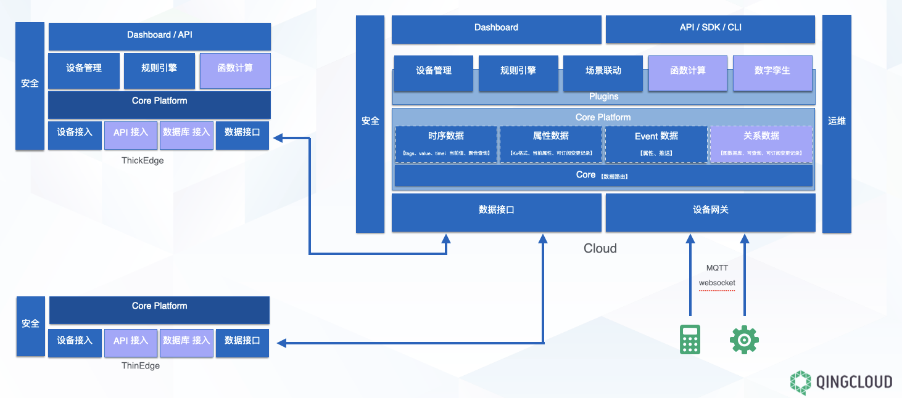

# TKeel 物联网Paas平台

----

## TKeel 是什么

> [English](README.md) | 中文

[TKeel](https://tkeel.io) 是一个连接开发者、制造商及终端用户的开放物联网Paas平台，致力于协助ISV、甲方客户、硬件厂商等构建极大丰富的物联网生态系统，并提供以下能力：

	—— SV（传统物联网厂商）：TKeel可以帮助他们解决系统的扩展性以及大数据量下的稳定性，避免他们学习过多的新技术（influxdb、kafka等），同时上述技术需要与他们已有的成熟体系低成本的融合。
	—— 甲方客户：TKeel可以帮助他们以标准方式实现多系统接入，提供场景编排能力、数据对接能力、多权限管理、行业模型等能力，同时可以集成其他产品线形成整体解决方案。
	—— 硬件厂商：TKeel可以帮助他们进行设备管理、平台提供日志、监控、计量、计费、多租户等能力，帮助他们进行快速的业务创新。

TKeel 的发音是 ['tki։l]，它本意是船的龙骨，意指我们做的是物联网核心框架，目标是提供高扩展、插件化的开源的 IoT Platfor平台，建设功能丰富、面向行业的商业 Paas、SaaS 服务。

TKeel 目前最新的版本为 0.1.0，所有版本 100% 开源，关于 TKeel 更详细的介绍与说明请参阅 [什么是 TKeel](https://tkeel.io/docs/introduction/what-is-tkeel/)。

## 快速体验

使用体验账号 `demo1 / Demo123` 登录 [Demo 环境](https://demo.tkeel.io/)，该账号仅授予了 view 权限，建议自行安装体验完整的管理功能。

## 架构

TKeel 采用了前后端分离的架构设计，后端的各个功能组件可通过 REST API 对接外部系统，详见 [架构说明](https://tkeel.io/docs/introduction/architecture/)。本仓库仅包含后端代码，前端代码参考 [Console 项目](https://github.com/tkeel/console)。

## 核心功能

|功能 |介绍 |
| --- | ---|
| 数据接入 | 提供海量设备进行快速数据接入能力 |
| 设备管理 | 提供设备管理能力 |
| 安全机制 | 提供插件隔离、用户角色管理、颁发设备Token等安全机制 |
| 插件管理 | 提供可插拔的基础插件管理功能 |
| 多租户管理 | 提供基于角色的细粒度多租户统一认证，提供多层级的权限管理 |
| 丰富的可观察性功能 | 提供基于多租户的日志查询与日志收集，支持应用层级的告警与通知 |

以上功能说明详见 [产品功能](https://tkeel.io																																																																																																																																																																																																																																																																																																																																																																																																																																																																																																																																																																																																																																																																																																																																																																																																																																																																																																																																																																																																			/docs/introduction/features/)。

----

## 最新发布

TKeel 0.1.0 将于 2021 年 9 月 30 日正式上线，点击 [Release Notes For 0.1.0](https://tkeel.io/docs/release/release-v010/) 查看 0.1.0 版本的更新详情。

## 安装 0.1.0

### 快速入门

[快速入门系列](https://tkeel.io/docs/quick-start/) 提供了快速安装与入门示例，供初次安装体验参考。

### 基于 Linux 安装 TKeel

- [在 Ubuntu 安装 TKeel](https://tkeel.io/docs/installing-on-linux/ubuntu/install-tkeel-on-ubuntu/)
- [在 CentOS 安装 TKeel](https://tkeel.io/docs/installing-on-linux/centos/install-tkeel-on-centos/)

### 基于 Windows 安装 TKeel

- [在 Windows 安装 TKeel](https://tkeel.io/docs/installing-on-windows/windows/install-tkeel-on-windows/)

## 技术社区

[TKeel 社区](https://github.com/tkeel/community) 包含所有社区的信息，包括如何开发，兴趣小组(SIG)等。比如[开发指南](https://github.com/tkeel/community/tree/master/developer-guide/development) 详细说明了如何从源码编译、TKeel 的 GitHub 工作流、如何贡献代码以及如何测试等。

- [中文论坛](https://tkeel.io/forum/)
- [社区微信群（见官网底部）](https://tkeel.io/)
- [Bug 与建议反馈（GitHub Issue）](https://github.com/tkeel/tkeel/issues)

## 谁在使用 TKeel

[Powered by TKeel](https://tkeel/case/) 列出了哪些企业在使用 tkeel，如果您所在的企业已安装使用了 tkeel，欢迎[提交 PR](https://github.com/tkeel/tkeel/blob/master/docs/powered-by-tkeel.md)。

